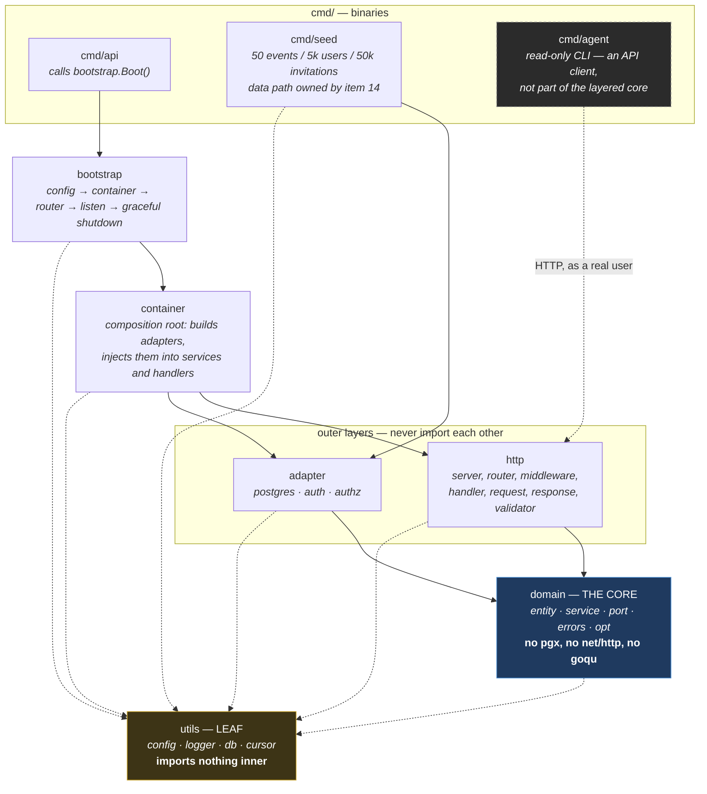
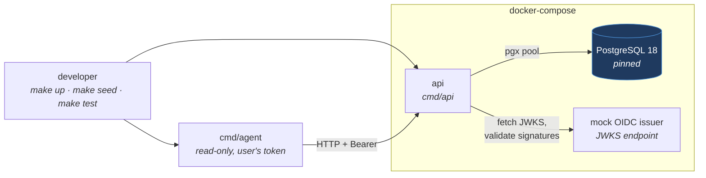

# Components diagram — architecture

Feature 01 deliverable; the components half of the required design diagram. The data model is in [`er-diagram.md`](./er-diagram.md). Refreshed by item 27 to match what shipped.

Two views: the **layers** and their permitted import direction, then **one request traced end to end** through them.

---

## 1. Layers

Dependencies point inward to `domain`. The domain knows nothing about the outer layers.

**Solid arrows are imports; dotted arrows to `utils` are the leaf exception; the dotted arrow from `agent` is a network call, not an import.**

Rules this encodes:

- `http` and `adapter` both depend on `domain` and **never on each other**. They meet only in `container`.
- Interfaces (`port.go`) are declared in `domain` beside the service that consumes them, and implemented in `adapter`. Handlers hold service interfaces, not concrete types.
- `container` may import everything; **nothing imports `container`**.
- `utils` is a leaf. Wiring never goes there — a leaf that inner layers import cannot also import them back.
- `cmd/agent` sits outside the core entirely. It talks HTTP to the public API as an authenticated user and inherits that user's authorization; it has no database handle and no elevated key.

### One concern, one place

The authz chokepoint deliberately spans layers, with each layer owning exactly one part of it:

| Concern | Lives in |
|---|---|
| The `can(user, action, resource)` policy **interface** | `domain` |
| The `role_permissions` **data** | `adapter/authz` |
| **Enforcement** — is this request allowed at all | `http/middleware` |
| **Body filtering** — what this role may see in the response | `http/response` presenters |

Same shape for errors: `domain` declares `ErrConflict`; `adapter/postgres` recognises the `EXCLUDE` or version violation and returns it; `http` maps it to 409. No layer reaches around another.

---

## 2. Request flow

`POST /v1/events/{eventId}/sessions` — the path that exercises auth, authz, idempotency, the conflict constraint, and audit in one go.

```mermaid
sequenceDiagram
    autonumber
    participant C as Client
    participant MW as http/middleware
    participant H as http/handler
    participant S as domain/session<br/>Service
    participant R as adapter/postgres<br/>SessionRepository
    participant PG as PostgreSQL 18

    C->>MW: POST /v1/events/{id}/sessions<br/>Bearer token · Idempotency-Key

    Note over MW: request-id → recover → auth → authz → idempotency
    MW->>MW: request-id: attach correlation id
    MW->>MW: auth: validate JWT via JWKS<br/>(signature, expiry, audience)
    MW->>R: map sub claim → users row
    R-->>MW: actor
    MW->>MW: authz: can(actor, session:create, event)<br/>via role_permissions
    alt no permission
        MW-->>C: 403 · {"error":{"code":"forbidden"}}<br/>no leak of what exists
    end
    MW->>MW: idempotency: replay stored response if key seen

    MW->>H: handler.createSession(ctx, actor)
    H->>H: decode + validate request DTO<br/>(Optional[T] for nullable fields)
    alt invalid
        H-->>C: 422 · issues in details
    end
    H->>S: CreateSession(ctx, cmd)

    Note over S: invariants only — no SQL, no HTTP
    S->>R: Create(ctx, session)

    rect rgb(40, 55, 75)
        Note over R,PG: one transaction
        R->>PG: INSERT INTO sessions … RETURNING NEW
        Note right of PG: EXCLUDE (room_id, time_range)<br/>EXCLUDE (speaker_id, time_range)
        alt overlap
            PG-->>R: 23P01 exclusion_violation
            R-->>S: domain.ErrConflict
            S-->>H: ErrConflict
            H-->>C: 409 · {"error":{"code":"session_conflict"}}
        end
        PG-->>R: new row
        R->>PG: INSERT INTO audit_log<br/>(actor_id, before=NULL, after=NEW, request_id)
        PG-->>R: committed
    end

    R-->>S: session
    S-->>H: session
    H->>H: response presenter for actor's role<br/>(attendee: no roster, no email)
    H-->>MW: 201
    MW->>PG: store response under Idempotency-Key
    MW-->>C: 201 · session
```

### What the flow is asserting

| Step | Guarantee | Item |
|---|---|---|
| auth validates, never issues | The API has no signing key and no `/login`. Tokens come from the OIDC issuer — mock in compose, hosted in prod, one env var apart. | 06 |
| authz before the handler | Permission is checked at a single chokepoint reading `role_permissions`, not in the handler. | 07 |
| idempotency wraps the write | A retried request replays the stored response; the unique constraint deduplicates, not a preceding `SELECT`. | 21 |
| `INSERT` carries the conflict check | The overlap is caught by the constraint inside the statement. There is no `SELECT`-then-`INSERT` window to race. | 16 |
| audit shares the transaction | The mutation and its audit row commit or roll back together. Never a second call afterwards. | 22 |
| presenter runs on the way out | Field visibility is role-driven and applied in `http/response`, so authorization governs the body, not just reachability. | 10 |

The error path back out follows the same layering in reverse: Postgres raises `23P01`, `adapter/postgres` translates it to `domain.ErrConflict`, and `http` renders the one error envelope with a stable machine-readable code.

---

## 3. Runtime topology

What `make up` starts.

Swapping the mock issuer for a hosted one is an env-var change; the validation code is identical in both.
