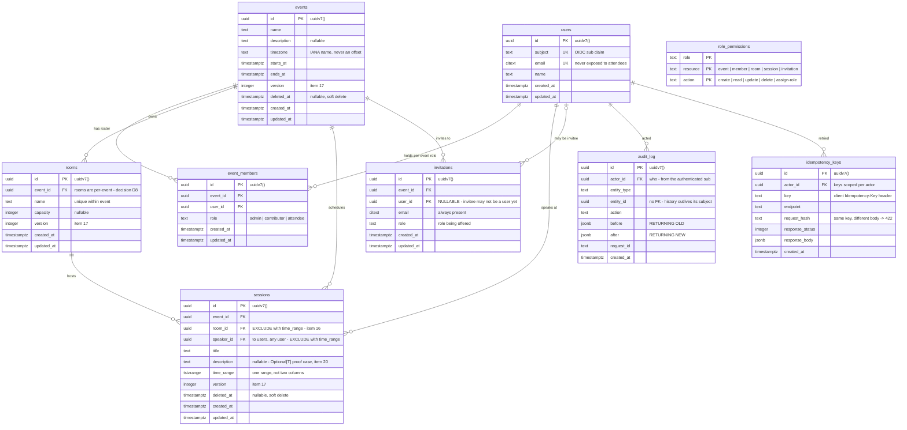

# ER diagram — data model

Feature 01 deliverable; the data-model half of the required design diagram. Attribute rationale lives in [`requirements.md`](./requirements.md) §2. Refreshed by item 27 to match what shipped.

Nine tables. Columns whose owning feature is later than item 02 are drawn now and tagged with that item, so item 27's refresh is a text edit rather than a redraw.

`role_permissions` stands alone: it is keyed by the `role` *string*, not by a FK to `event_members`. That is deliberate — the chokepoint loads the whole table once and answers `can(user, action, resource)` from memory, and adding a role stays an INSERT.

## Uniqueness and exclusion constraints

The constraints carry the correctness guarantees; the columns above only make them expressible.

| table | constraint | purpose | item |
|---|---|---|---|
| `users` | `unique (subject)` | one row per OIDC identity | 06 |
| `users` | `unique (email)` | | 02 |
| `event_members` | `unique (event_id, user_id)` | one role per person per event | 09 |
| `rooms` | `unique (event_id, name)` | | 11 |
| `sessions` | `EXCLUDE USING gist (room_id WITH =, time_range WITH &&) WHERE (deleted_at IS NULL)` | **no room double-booking** | 16 |
| `sessions` | `EXCLUDE USING gist (speaker_id WITH =, time_range WITH &&) WHERE (deleted_at IS NULL)` | **no speaker double-booking** | 16 |
| `invitations` | `unique (event_id, email)` | row-level invite dedup, independent of header replay | 21 |
| `idempotency_keys` | `unique (actor_id, key)` | retry replays, never double-sends | 21 |

Both `EXCLUDE` constraints are **partial** (`WHERE deleted_at IS NULL`) so a soft-deleted session releases its slot. Both require `btree_gist` for the `uuid WITH =` operand.

## Legend and reading notes

- **`uuidv7()`** — PG18 native. Time-ordered, so the PK doubles as the keyset cursor and no separate sort column is needed (item 19).
- **`timestamptz` everywhere.** An absolute instant. Local time is rendered by applying `events.timezone` on the way out; it is never stored.
- **`events.timezone`** holds an IANA name (`Asia/Colombo`), never a fixed offset — an offset cannot survive a DST transition, which is the item 12 test.
- **`tstzrange`** rather than `starts_at`/`ends_at` because `EXCLUDE` needs a range type. Two columns would push the overlap check back into Go, which is the check-then-act race the brief is testing for.
- **`version`** is on every mutable row (`events`, `rooms`, `sessions`). Updates are `WHERE id = $1 AND version = $2`; 0 rows affected is a 409, never a last-write-wins.
- **`deleted_at`** — soft delete on `events` and `sessions` only. Membership, rooms and invitations are removed outright. Because item 16's `EXCLUDE` constraints are partial on this column, soft-deleting a session **releases its room and speaker slot immediately** — an intended product rule (D9, [`requirements.md`](./requirements.md) §7.3), not a side effect.
- **`audit_log.entity_id` has no FK** on purpose: the log must outlive whatever it describes.
- **Grants:** the application role holds `INSERT, SELECT` on `audit_log` and nothing else. Append-only is enforced by the grant, not by discipline.

## Deferred

- **Recurring sessions** (item 23) will add a rules-plus-exceptions pair of tables and a schedule history. Nothing above anticipates it — deliberately, since the shape depends on how far that item gets scoped.
- **Shared physical rooms across events** are out of scope. `rooms` hangs off `events`, so two events in the same building are two rows and a clash between them is not detected. Deliberate — it keeps the `EXCLUDE` constraint covering exactly what the model claims. See [`requirements.md`](./requirements.md) §7.1.
